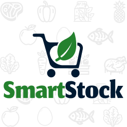

# SmartStock

  

## Introdução

SmartStock é uma solução inovadora desenvolvida para facilitar o gerenciamento de estoques de alimentos perecíveis. Com foco em reduzir desperdícios e otimizar a gestão de inventários, nosso aplicativo oferece uma plataforma intuitiva para controle de validades, quantidades e informações nutricionais de alimentos armazenados.

## Índice

- [Introdução](#introdução)
- [Instalação](#instalação)
- [Uso](#uso)
- [Funcionalidades](#funcionalidades)
- [Dependências](#dependências)
- [Configuração](#configuração)
- [Documentação](#documentação)
- [Exemplos](#exemplos)
- [Solução de Problemas](#solução-de-problemas)
- [Contribuidores](#contribuidores)
- [Licença](#licença)

## Instalação

Instruções sobre como instalar o SmartStock

## Uso

Guia passo a passo de como utilizar as principais funcionalidades do aplicativo, incluindo como adicionar, editar e remover itens do estoque, além de visualizar relatórios de validade.

## Funcionalidades

- **Cadastro de produtos**: Ao receber novos produtos, o supermercado cadastra cada item no sistema, incluindo informações essenciais como nome, quantidade/peso, data de validade/tempo que o produto pode ficar armazenado, data de recebimento e localização no estoque. Este processo garante que todos os produtos estejam rastreáveis dentro do sistema.
- **Monitoramento de validade**: O sistema automaticamente monitora as datas de validade dos produtos cadastrados. Ele alerta os funcionários sobre os produtos que estão próximos do vencimento, permitindo que tomem ações para promover, descontar ou remover esses itens da venda.
- **Agilidade no atendimento**:Com a localização precisa de cada produto no estoque, os funcionários conseguem preparar e despachar pedidos rapidamente, melhorando a experiência do cliente.

## Dependências

Lista de todas as dependências de software necessárias para instalar e executar o SmartStock.

## Configuração

Detalhes sobre como configurar o aplicativo após a instalação, se aplicável.

## Documentação

Links para a documentação completa do aplicativo, incluindo manuais do usuário, API docs, e FAQs.

## Exemplos

Exemplos práticos de como o aplicativo pode ser utilizado no dia a dia para gerenciar eficientemente um estoque de alimentos perecíveis.

## Solução de Problemas

Soluções para problemas comuns encontrados pelos usuários, incluindo erros de instalação, problemas de compatibilidade e perguntas frequentes.

## Contribuidores

Reconhecimento das pessoas que contribuíram para o desenvolvimento do aplicativo.

## Licença

Informações sobre a licença sob a qual o aplicativo é distribuído, explicando os direitos e limitações dos usuários finais.

