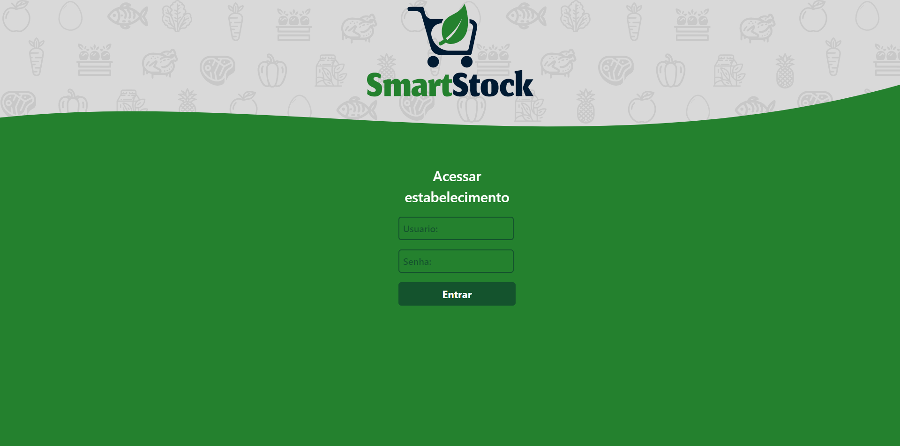
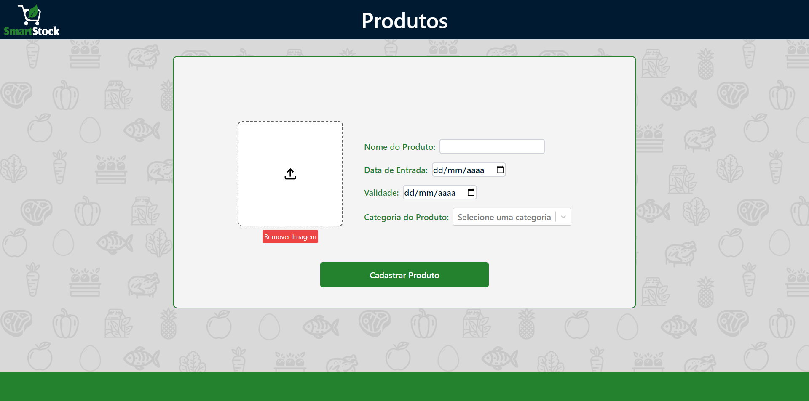
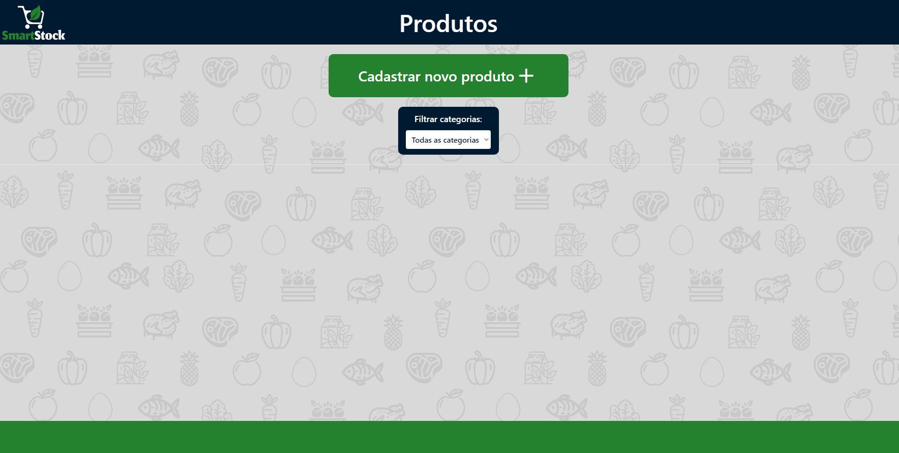

## Grupo do Projeto

- Arthur Francisco, Arthur Palmeira, Higor Matheus e José Samuel

## Nome do Projeto

 **SmartStock** 

## Descrição

SmartStock  é um aplicativo que facilita dinamicamente o gerenciamento de produtos pereciveis em seu estoque.

## Publico:

Ideal para:

Pequenos a médios negócios no setor de varejo, especialmente aqueles que lidam com produtos perecíveis, como mercados, lojas de conveniência, e estabelecimentos de alimentação, buscando uma solução robusta e fácil de usar para gerenciamento de estoque.

## Funcionalidades

- Adiconar e remover produtos
- Filtrar produtos por categorias
- Retirar produtos de acordo com a data de validade
- Compara e ordena os produtos

## Ferramentas Utilizadas

- Javascript
- React
- Tailwind

## Como Rodar o Código

ná pagina inicial do repositório clique em <> code e copie o url que está mostrando

dê git clone no reposítorio do projeto, abra o terminal e coloque

 $ git clone <código url copiado>

 ## Link do site no vercel
 https://smart-stock-three.vercel.app/

### Pré-requisitos

O que precisa ser instalado para rodar o projeto e como instalá-los, por exemplo:

npm install react 
npm install react-router-dom

também pode ser usado o npm install no terminal para baixar tudo de uma vez

## Imagens :

 
 
 

